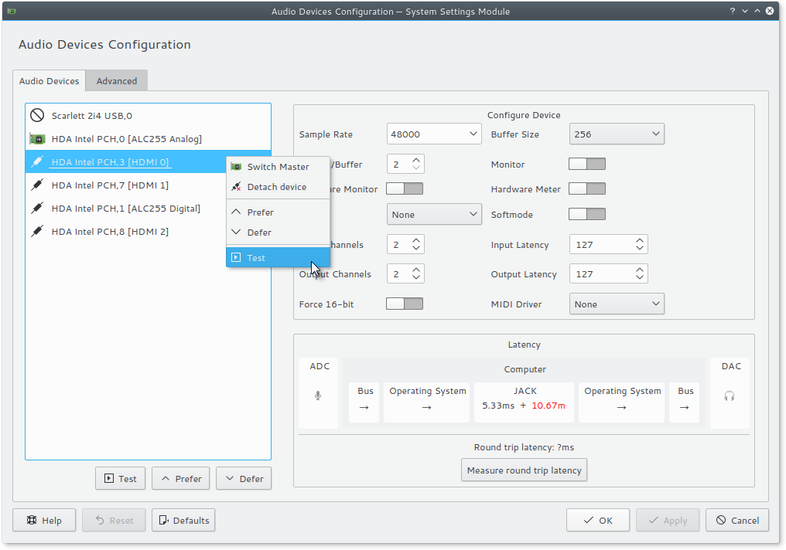

KCM module for [jackman](https://github.com/progwolff/jackman), a tool that helps managing multiple audio interfaces with [Jack](https://github.com/jackaudio).

> [!IMPORTANT]
> This project is currently unmaintained.

[](https://travis-ci.org/progwolff/jackman_kcm)



# Installation

# Arch Linux

use the provided PKGBUILD

# Other Distros

```shell
$ mkdir build
$ cd build
$ cmake .. -DCMAKE_INSTALL_PREFIX="/usr"
# make install
```
